# Cards for Mille Bornes

From [WikiPedia](https://en.wikipedia.org/wiki/Mille_Bornes#List_of_cards)

## Card Images

### Attribution
By Original image by w:User:John Reid, vectorized by User:LordRM., CC BY-SA 3.0, https://commons.wikimedia.org/wiki/Commons:Reusing_content_outside_Wikimedia
```txt
By Original image by w:User:John Reid, vectorized by User:LordRM., CC BY-SA 3.0, https://commons.wikimedia.org/wiki/Commons:Reusing_content_outside_Wikimedia
```
```html
By Original image by <a href="https://en.wikipedia.org/wiki/User:John_Reid" class="extiw" title="w:User:John Reid">w:User:John Reid</a>, vectorized by <a href="//commons.wikimedia.org/wiki/User:LordRM" title="User:LordRM">User:LordRM</a>. - <a class="external free" href="https://en.wikipedia.org/wiki/Mille_Bornes#List_of_cards">https://en.wikipedia.org/wiki/Mille_Bornes#List_of_cards</a>, <a href="http://creativecommons.org/licenses/by-sa/3.0/" title="Creative Commons Attribution-Share Alike 3.0">CC BY-SA 3.0</a>, <a href="https://commons.wikimedia.org/wiki/Commons:Reusing_content_outside_Wikimedia">Link</a>
```
### Table of Cards
The deck has 106 playable cards.
| Card Name | File Name | Image | Count |
|-----------|-----------|-------|-------|
| Accident | MB-crash.svg |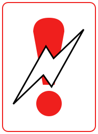|  3 |
| Out of Gas | MB-empty.svg |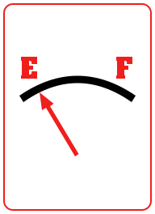|  3 |
| Flat Tire | MB-flat.svg |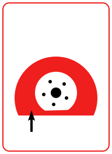|  3 |
| Speed Limit | MB-limit.svg |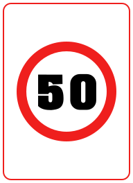|  4 |
| Stop | MB-stop.svg |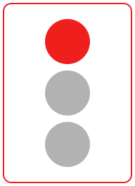|  5 |
| Repairs | MB-repair.svg |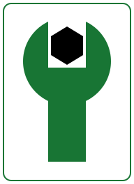|  6 |
| Gasoline | MB-gas.svg |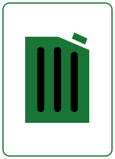|  6 |
| Spare Tire | MB-spare.svg |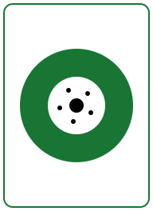|  6 |
| Go / Drive | MB-roll.svg |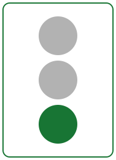| 14 |
| End Speed Limit | MB-unlimited.svg |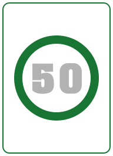|  6 |
| Driving Ace | MB-ace.svg |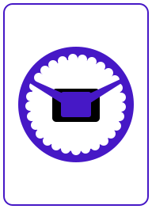|  1 |
| Extra Tank | MB-tanker.svg |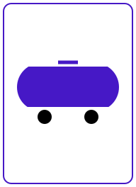|  1 |
| Right of Way / Ambulance | MB-emergency.svg |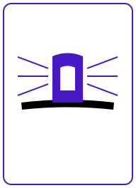|  1 |
| Distance  25 | MB-25.svg |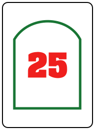| 10 |
| Distance  50 | MB-50.svg |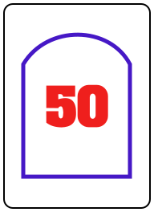| 10 |
| Distance  75 | MB-75.svg |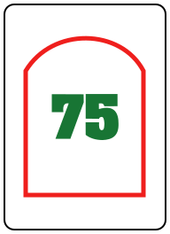| 10 |
| Distance 100 | MB-100.svg |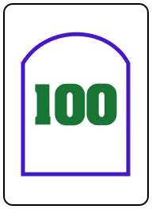| 12 |
| Distance 200 | MB-200.svg |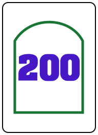|  4 |
