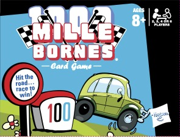

# GameDevelopment
A collection of simple Game-based challenges to explore Development and Deployment patterns

## Mille Bornes


[© 2009 Hasbro, Pawtucket, RI 02862. All Rights Reserved.](http://hasbrogames.com)

A simple recreation of the Mille Bornes Game written from scratch as a dotNet Solution written mostly in C#.
The goal is to follow development best practices and build this methodically, using it as a real-world training exercise.

[Card Game Instructions](https://instructions.hasbro.com/api/download/17147_en-us_mille-bornes-card-game.pdf)

### Project Objectives
1. Write the core engine for the MILLE BORNES Game.
1. A simple text adventure interface added separately.
1. Explore exposing the text to a webpage based interaction.

### Card Handling
Initally, using the name in CardImages/README.md and the count, populate an Array with the Official Deck Of Cards, in Order.
Next, will be to utilize an algorithm to have an array of indexes into the Official Deck Of Cards and "shuffle" it in order to gain a random set of indexes to hand out to each player on the initial Deal and subsequent Draws from the remaining Game's Pile.

#### Shuffle
References:
[Best way to randomize an array with .NET](http://stackoverflow.com/questions/108819/ddg#110570)
>The following implementation uses the Fisher-Yates algorithm AKA the Knuth Shuffle. It runs in O(n) time and shuffles in place, so is better performing than the 'sort by random' technique, although it is more lines of code. See here for some comparative performance measurements. I have used System.Random, which is fine for non-cryptographic purposes.* 
```Csharp
static class RandomExtensions
{
    public static void Shuffle<T> (this Random rng, T[] array)
    {
        int n = array.Length;
        while (n > 1) 
        {
            int k = rng.Next(n--);
            T temp = array[n];
            array[n] = array[k];
            array[k] = temp;
        }
    }
}
```
Usage: 
```Csharp
var array = new int[] {1, 2, 3, 4};
var rng = new Random();
rng.Shuffle(array);
rng.Shuffle(array); // different order from first call to Shuffle
```
> \* For longer arrays, in order to make the (extremely large) number of permutations equally probable it would be necessary to run a pseudo-random number generator (PRNG) through many iterations for each swap to produce enough entropy. For a 500-element array only a very small fraction of the possible 500! permutations will be possible to obtain using a PRNG. Nevertheless, the Fisher-Yates algorithm is unbiased and therefore the shuffle will be as good as the RNG you use.
>
>--Matt Howells